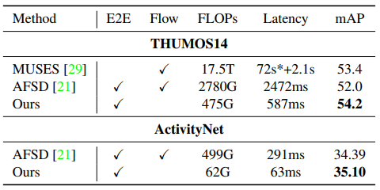

# E2E-TAD
This repository holds the code for the following paper:
> [An Empirical Study of End-to-end Temporal Action Detection](https://arxiv.org/abs/2204.02932) <br/>
> [Xiaolong Liu](https://github.com/xlliu7), [Song Bai](https://songbai.site), [Xiang Bai](https://scholar.google.com/citations?user=UeltiQ4AAAAJ&hl=zh-CN) <br/>
> CVPR 2022.

This paper presents an empirical study of end-to-end temporal action detection (TAD). It 
- reveals the benefit of end-to-end training. We observe up to 11% performance improvement.
- studies the effect of a series of design choices in end-to-end TAD, including detection head, video encoder, spatial and temporal resolution of videos, frame sampling manner and multi-scale feature fusion.
- establishes a baseline detector. Built upon SlowFast and [TadTR][tadtr], it outperforms previous SOTA methods such as MUSES and AFSD with more than 4x faster speed, *using only RGB modality*. It can process *5076 frames per second* on a single TITAN Xp GPU. <br/>


<!-- We're currently refactoring the codebase to make it a generic framework for end-to-end temporal action detection. We hope to release the  -->
We hope that E2E-TAD can accelerate the research and applications of end-to-end temporal action detection. 

Update 2022/6/9: We plan to release the code in the second half of June.

## Models
### THUMOS14
|Config|Encoder|Head   |SR, TR |  AmAP |GPU Mem.|Training Speed|Weight|
|:-:|:-:|:-:|:-:|:-:|:-:|:-:|:-:|
|link|SlowFast R50 4x16| TadTR|96, 10FPS| 54.2|7.6G|17 min/epoch|[OneDrive]|


### ActivityNet
|Config|Encoder| Head   |SR, TR|  AmAP |GPU Mem.|Train Speed|Weight|
|:-:|:-:|:-:|:-:|:-:|:-:|:-:|:-:|
|link|SlowFast R50 4x16| TadTR|96, 384|35.10|11G|62 (30)\* min/epoch|[OneDrive]|
|link|TSM R50|TadTR|96, 96|34.14|10G|30 (19) min/epoch|[OneDrive]|
<!-- |-|TSM R18|[TadTR][tadtr]|96, 96|33.42|3.6G|12 (8) min/epoch|[OneDrive]| -->

\* The values in the brackets are measured on RTX 3090, others on TITAN Xp.

SR: spatial (image) resolution. TR: temporal resolution, measured by the sampling frame rate on THUMOS14 and the number of sampled frames per video on ActivityNet.
 


## Citation
```
@inproceedings{liu2022an,
  title={An Empirical Study of End-to-end Temporal Action Detection},
  author={Liu, Xiaolong and Bai, Song and Bai, Xiang},
  booktitle={Proceedings of the IEEE/CVF Conference on Computer Vision and Pattern Recognition},
  pages={20010-20019},
  year={2022}
}
```

## Related Projects
- [TadTR][tadtr], an efficient and flexible Transformer network for temporal action detection.


[tadtr]: https://github.com/xlliu7/TadTR
